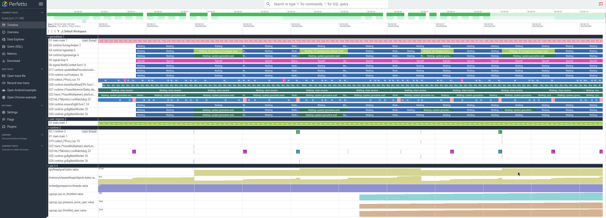

# gander

**Find out _why_ your Go service stalled — automatically.**



> _One capture, every signal on the same timeline: the lanes are goroutine state
> and GC; the tracks at the bottom are the kernel's CPU-throttling / pressure
> counters — so a stall lines up with its cause at a glance. Produced by `gander
> emit` and opened in [ui.perfetto.dev](https://ui.perfetto.dev)._

When a unit of work in your program (a request, a loop iteration, a queued
message) takes longer than it should, `gander` grabs a snapshot of everything
happening at that moment — the Go execution trace, what the kernel was doing to
your process (CPU throttling, CPU pressure), and every goroutine's stack — lines
them all up on one timeline, and tells you in plain findings what went wrong.

The name is "take a gander" — to look closely.

It's built for latency-sensitive services where one slow piece of work holds up
everything behind it — matching engines, message dispatchers, tight hot loops.
That kind of stall is like one slow checkout lane backing up the whole store:
average-based profilers say "CPU looks fine," but every customer behind the slow
one waited. gander is made to catch exactly that.

> **Requirements:** Go **1.25+** (it uses the new `runtime/trace.FlightRecorder`).
> The kernel signals (CPU throttling, CPU pressure) are Linux-only; on other
> platforms they're simply skipped and everything else still works.

## Why gander? (vs. the tools you already have)

When a service is "sometimes slow," each existing tool answers a *different*
question — and none of them answers "what went wrong, _right at the slow moment_?"

| Tool | Good at | Catches the stall on its own? | Sees kernel CPU throttling / pressure? | Tells you the cause? |
|------|---------|:---:|:---:|:---:|
| **pprof** | where CPU/memory goes *on average* | ❌ you sample manually | ❌ | ❌ aggregates, no timeline |
| **Parca / Pyroscope** (continuous profiling) | CPU/memory over time, fleet-wide | ✅ always-on, sampled | ❌ | ❌ aggregates, no per-stall timeline |
| **go tool trace** / gotraceui | reading one captured trace | ❌ you capture by hand | ❌ | ❌ you interpret it yourself |
| **eBPF tools** (bcc, bpftrace) | kernel scheduling / off-CPU waits | ⚠️ if you script it | ✅ | ❌ blind to on-CPU stalls (e.g. GC) |
| **Odigos** (eBPF auto-instrumentation) | zero-code distributed traces (OTel) | ✅ continuous | ⚠️ only as side metrics | ⚠️ span level, not per-goroutine |
| **APM / dashboards** (Datadog, Grafana) | fleet-wide trends & request traces | ✅ sampled | ⚠️ partial | ⚠️ coarse, not down to a goroutine |
| **gander** | one slow service, on one machine | ✅ **heartbeat trigger** | ✅ **no eBPF needed** | ✅ **deterministic findings** |

> **gotraceui currently panics on Go 1.25 traces** — open issue
> [dominikh/gotraceui#184](https://github.com/dominikh/gotraceui/issues/184)
> (likely fixed in a future release). gander reads Go 1.25 traces today and
> converts them to the Perfetto timeline — it drives `x/exp/trace`'s reader
> directly, not gotraceui's `ptrace` layer (where the panic is). See
> [Convert any Go trace](#convert-any-go-trace).

gander's niche is narrow on purpose: a **single process, on a single machine**,
that catches a stall *as it happens* and explains it. It is **not** a fleet-wide
observability platform — it's what you reach for when one service is mysteriously
slow and the dashboards insist CPU looks fine.

## Install

```bash
go install github.com/vucong2409/gander@latest
# or, from a clone:
go build -o gander .
```

## Quick start

Three steps: make a stall, look at it, diagnose it.

```bash
# 1. Run the built-in demo. It does fake work and stalls on purpose, writing a
#    snapshot ("bundle") to bundles/<timestamp>/ each time a stall is caught.
gander demo --stall-chan --budget=10ms

# 2. Turn a snapshot into a visual timeline.
gander emit bundles/<timestamp>     # writes fused.json
#    → open that fused.json file at https://ui.perfetto.dev

# 3. Ask gander what went wrong.
gander diag bundles/<timestamp>
```

`gander diag` prints findings in plain English, for example:

```
[warn] a work-unit exceeded its latency budget
       work-unit ran 11ms (budget 10ms) — 1.1x over
[warn] the slowest work-unit and what blocked it
       the slowest work-unit ran on G1 main.main for 41ms;
       it spent 40ms blocked on "chan receive"
[info] wait time by block reason
       select 4282ms; chan receive 3430ms; sleep 492ms
```

The Perfetto timeline from step 2 shows the same story visually: one lane per
goroutine (labelled by function), GC pauses, arrows showing who woke whom, and
the kernel's CPU-throttling/pressure numbers as tracks right beside them.

## How it works

Two simple parts, all pure Go plus a few `/proc` and cgroup files — no eBPF, no
`perf`, no special privileges:

1. **Watch and capture.** A lightweight heartbeat times each unit of work. The
   moment one runs over its budget, gander saves a *bundle*: the recent execution
   trace (the lead-up to the stall), the kernel's CPU-throttling and pressure
   numbers, and a dump of every goroutine — all stamped onto one shared clock.
2. **Diagnose.** `gander diag` runs a fixed set of rules over that bundle and
   prints scored findings: how far over budget you went, which goroutine was
   slowest and what it was blocked on, whether the kernel throttled your CPU, and
   where the wait time went. The rules are fully deterministic — same bundle in,
   same findings out — so there's no guessing and nothing to second-guess.

## Embed in your own program (experimental)

You can wire gander into a Go program directly, so it auto-captures a bundle
whenever a work-unit overruns its budget:

```go
import "github.com/vucong2409/gander/record"

r, _ := record.Start(record.Options{
    Budget:    10 * time.Millisecond,
    BundleDir: "/var/gander",
})
defer r.Stop()

for msg := range queue {
    end := r.Begin(ctx) // marks the start of a work-unit
    process(msg)
    end()               // marks the end
}
```

Then inspect the bundles it writes with `gander emit` / `gander diag`.

**Overhead.** Marking a work-unit (`Begin` + end) costs about **40 ns** with no
trace running and **~200 ns** while the flight recorder is armed — one small
allocation per unit (two while armed), no locks, no syscalls (linux/amd64; reproduce with
`go test -bench=Begin -benchmem ./record`). At 100k work-units/sec the armed cost
is roughly 2% of one core; below ~10k/sec it's in the noise.

> **Heads up:** the `record` API is unit-tested but has **not** been run inside a
> real production service yet, and both it and the findings format may still
> change. Treat it as experimental.

## Capturing: choose your trigger

Recording is always on once you `Start`; the *triggers* just decide when a bundle
is written. Pick any combination (`Options.Triggers`, OR'd together) — and
`Snapshot` / `Handler` are always available regardless.

| Trigger | Fires when | Config | Reach for it when |
|---|---|---|---|
| `OnBudget` *(default)* | a `Begin`'d work-unit overruns its budget | `Budget` | you can mark work-units and want auto-capture on a latency miss |
| `OnSignal` | the process gets a signal (`kill -USR1 <pid>`) | `Signal` | ops wants the last few seconds on demand, no code change |
| `Continuous` | every `Interval`, keeping the last `Keep` | `Interval`, `Keep` | always-on rolling capture — never miss it |
| `Snapshot(reason)` *(always on)* | you call it | — | from your own logic: a 5xx, a slow query, a breaker trip |
| `Handler()` *(always on)* | an HTTP GET hits the endpoint | mount on a mux | pull a capture at runtime, à la `net/http/pprof` |

`Options.Window` sets how far back each capture reaches (the flight-recorder
look-back). `Begin` is only needed for `OnBudget` — the other triggers work with
zero hot-path instrumentation.

```go
r, _ := record.Start(record.Options{
    Triggers: record.OnSignal | record.Continuous,
    Window:   5 * time.Second,
    Interval: 30 * time.Second, Keep: 20,
})
defer r.Stop()

mux.Handle("/debug/gander/", r.Handler())     // pull over HTTP, and/or…
if slow { r.Snapshot("checkout p99 breach") } // …capture from your own code
```

See **[docs/triggers.md](docs/triggers.md)** for each trigger's behavior, overhead,
and how they compare.

## Convert any Go trace

`gander emit` doubles as a standalone converter: point it at **any Go 1.25
execution trace** — a flight-recorder snapshot, `runtime/trace` output, a
`go test -trace` file, or a `/debug/pprof/trace` capture — and it writes the fused
Perfetto timeline beside it. You get every layer except the cgroup
CPU-throttling/pressure counters, which need gander's live sampler.

See **[docs/converting-traces.md](docs/converting-traces.md)** for the commands,
the supported trace sources, and the full layer breakdown.

## Status

Working proof-of-concept. The capture → timeline → diagnose loop runs end-to-end
on the built-in demo (see [`docs/linux-validation.md`](docs/linux-validation.md)).
CPU throttling and pressure are Linux-only (skipped elsewhere; the trace and
diagnosis still work). The `record` API and the findings format are not yet
stable.

## License

[Apache License 2.0](LICENSE). © 2026 the gander authors.
